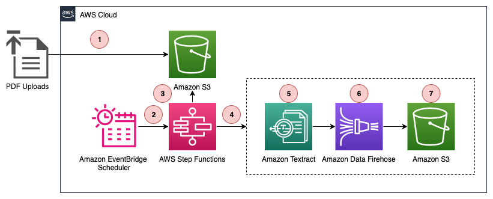

# Exporting to Amazon S3 Tables with AWS Step Functions Distributed Map

This repository showcases a serverless solution that processes PDF fors using AWS Step Functions Distributed Map, extracts data with Amazon Textract, and stores results in Amazon S3 Tables in Iceberg format.

See the accompanying blog post [How to export to Amazon S3 Tables by using AWS Step Functions Distributed Map](https://aws.amazon.com/blogs/compute/how-to-export-to-amazon-s3-tables-by-using-aws-step-functions-distributed-map/) for a detailed description.

## Overview

The repository demonstrates how to:
- Process PDF forms at scale using Step Functions Distributed Map
- Extract structured data from PDFs using Amazon Textract
- Store data in Amazon S3 Tables (Iceberg format) via Kinesis Data Firehose
- Schedule automated processing with Amazon EventBridge Scheduler

> **Warning**
> This application is not ready for production use. It was written for demonstration and educational purposes. Review the [Security](#security) section of this README and consult with your security team before deploying this stack. No warranty is implied in this example.

> **Note**
> This architecture creates resources that have costs associated with them. Please see the [AWS Pricing](https://aws.amazon.com/pricing/) page for details and make sure to understand the costs before deploying this stack.

## How the application works



The solutions comprises of the below steps:

1.	A user uploads customer interest forms as scanned PDFs to an Amazon S3 bucket.
2.	An Amazon EventBridge Scheduler rule triggers at regular interval, initiating a Step Functions workflow execution.
3.	The workflow execution activates a Distributed Map State, which lists all PDF files uploaded to Amazon S3 since the previous run.
4.	The Distributed Map iterates over the list of objects and passes each objects metadata (Bucket, Key, Size, ETag) to a child workflow execution.
5.	For each object, the child workflow calls Amazon Textract with the provided Bucket and Key to extract raw text and relevant fields (name, email address, mailing address, interest area) from the PDF.
6.	The child workflow writes the extracted data to an Amazon Data Firehose, which is configured to forward data to an Amazon S3 Tables. 
7.	The Firehose batches the incoming data from the child workflow and writes it to the Amazon S3 Tables at a pre-configured time interval. 

## Deployment instructions   

### Prerequisites

* AWS CLI configured with appropriate permissions
* AWS SAM CLI installed

### Deploy the application with AWS SAM

1. **Clone the repository**
   ```bash
   git clone https://github.com/aws-samples/sample-exporting-to-amazon-s3-tables-with-aws-step-functions-distributed-map.git
   cd sample-exporting-to-amazon-s3-tables-with-aws-step-functions-distributed-map
   ```

2. **Deploy the stack**
   ```bash
   sam build
   sam deploy --guided
   ```

3. **Upload test PDFs**

   Upload PDF forms to your S3 bucket under the path: `RawInterestForms/YYYY/WW/`

5. **Trigger processing**

   Execute the Step Function manually or wait for the schedule

## Clean up

To avoid ongoing charges, delete the stack and associated resources:

```bash
sam delete
```

**Manual cleanup required:**
- S3 Tables bucket and data (if not empty)
- CloudWatch log groups (if retention is set)
- Any uploaded PDF files in the source bucket
   
## Security

See [CONTRIBUTING](CONTRIBUTING.md#security-issue-notifications) for more information.

## License

This library is licensed under the MIT-0 License. See the LICENSE file.

## DISCLAIMER

The solution architecture sample code is provided without any guarantees, and you're not recommended to use it for production-grade workloads. The intention is to provide content to build and learn. Be sure of reading the licensing terms.
